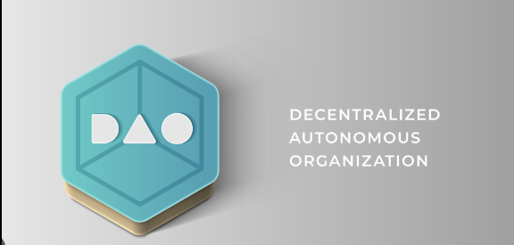
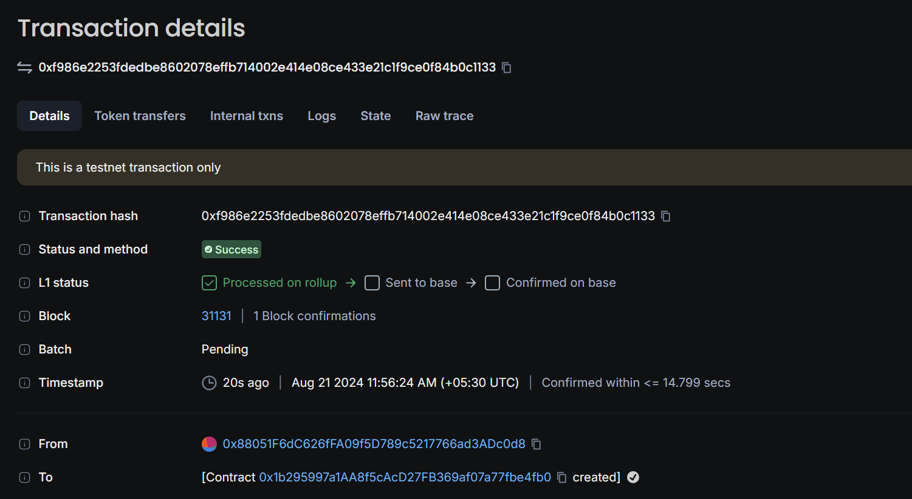

# ScholarshipDAO Smart Contract

## Vision
The ScholarshipDAO Smart Contract is designed to democratize and streamline the scholarship distribution process using the power of blockchain technology. Our vision is to create a transparent, decentralized, and fair system where students from all backgrounds can apply for scholarships and be evaluated based on merit and need. By leveraging Ethereum's decentralized infrastructure, we aim to eliminate biases and ensure that scholarship funds reach the most deserving candidates.

## Contract Address
- **Contract Address:**0xf986e2253fdedbe8602078effb714002e414e08ce433e21c1f9ce0f84b0c1133
**Contract Version:**^0.8.10

## Overview
The ScholarshipDAO contract allows applicants to submit their details, such as GPA, income, and community service hours, to be considered for scholarships. The contract owner has the authority to approve applicants based on predefined eligibility criteria and subsequently distribute scholarship funds to the approved candidates.

### Features
1. **Applicant Management**: 
   - Applicants can submit their details via the `applyForScholarship` function.
   - Eligibility is assessed based on GPA, income, and community service hours.

2. **Approval Process**:
   - The contract owner can approve applicants who meet the criteria through the `approveApplicant` function.
   - Approved applicants are stored in a list for easy reference.

3. **Fund Distribution**:
   - The contract owner can distribute the total Ether balance in the contract to all approved applicants via the `distributeScholarship` function.
   - The scholarship amount is equally divided among the approved candidates.

4. **Fund Reception**:
   - The contract is capable of receiving Ether, which will be distributed to the approved applicants.

## Future Scope
- **Decentralized Voting**: Implement a decentralized voting mechanism where existing scholarship recipients and community members can vote on new applicants.
- **Automated Approval Process**: Integrate AI algorithms to automate the approval process based on a more comprehensive set of criteria, including academic performance, financial need, and extracurricular activities.
- **Multiple Scholarship Funds**: Enable the contract to manage multiple scholarship pools, each with its own criteria and funding sources.
- **Cross-Chain Compatibility**: Expand the contract’s compatibility to other blockchain networks, allowing for cross-chain scholarship distribution.
- **Front-End Interface**: Develop a user-friendly front-end interface for applicants and administrators to interact with the contract seamlessly.

## Contact Details
For more information, support, or to contribute to this project, please contact us at:

- **Name**:Dhriti Dhara Nath
- **Email**: dhritinath950@gmail.com
- **GitHub**: (https://github.com/oligo434)

## Contribution
We welcome contributions from developers and blockchain enthusiasts who share our vision of creating a fair and transparent scholarship distribution platform. Please reach out if you're interested in collaborating or improving the project.

